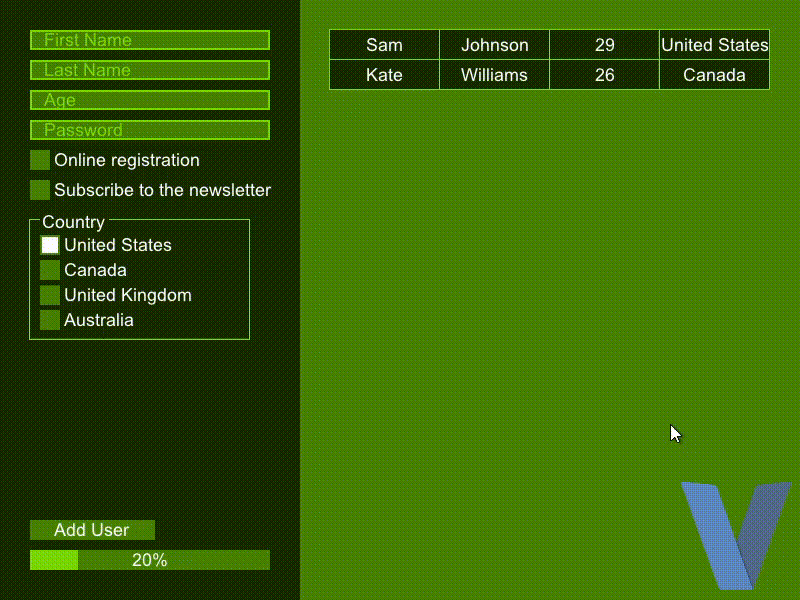
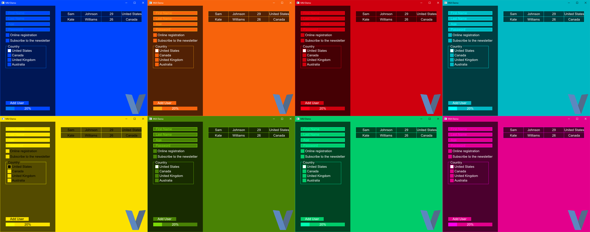

# MUI - A Cross-Platform UI Library _for V_



> **Supports Windows, Linux, Android<sup>1</sup>** & Web<sup>2</sup> (Experimental). *Not tested on MacOS<sup>3</sup>.*

> 1: System themes & map widget not working on Android now. If you interested with compiling for android, look [here](#compile-for-android)

> 2: With Emscripten. System themes & map widget not working now. If you interested with compiling for web, look [here](#compile-with-emscripten)

> 3: All critical processes (like Widget drawing, click handling etc.) should work on MacOS. But themes and screen reader won't work, and could be include MacOS-only bug.

## Example

```v
import mui as m

fn increase_count(event_details m.EventDetails,mut app &m.Window, app_data voidptr){
	unsafe{   app.get_object_by_id("count")[0]["text"].str=(app.get_object_by_id("count")[0]["text"].str.int()+1).str()   }
}

mut app:=m.create(m.WindowConfig{ title:"Counter - MUI Example", height:100, width:400 })

app.label(m.Widget{ id:"count", x:"5%x", y:"5%y", width:"45%x", height:"90%y" text:"0" })
app.button(m.Widget{ id:"count_button", x:"# 5%x", y:"5%y", width:"45%x", height:"90%y", text:"Count", onclick:increase_count })

app.run()
```

> You can find more examples in `./examples/` folder. Also you can visit [Gallery](./gallery.md "Gallery") that lists applications screenshots uses MUI.

> You can test MUI easily from [here](https://malisipi.github.io/mui/).

## Abilities

* Theme from system accent color, _If couldn't found accent color, use dark/light theme preference. If couldn't found dark/light theme preference, choose light theme_

* Widgets
    * Slider (Verical & Horizontal)
    * Button
    * Label
    * Textbox
    * Password
    * Group
    * Rect
    * Image
    * Progress
    * Radio Button
    * Checkbox
    * Link
    * Selectbox
    * Table
    * Graphs
        * Line Graph
        * Area Graph
    * Menubar
    * Map (Desktop Only)
    * Switch
    * Textarea
    * Codefield
    * Scrollbar (Verical & Horizontal)
    * Frames & Nested-Frames
* Custom/Thirdparty Widget Support (Not Finished Completely Yet)
* Screen Reader Support (Experimental - Linux & Windows Only)
* Emoji Icon Support (Desktop Only)
* Dialogs
    * Messagebox (Tinyfiledialogs & built-in & web)
    * Inputbox (Tinyfiledialogs & built-in & web)
    * Passwordbox (Tinyfiledialogs & built-in & web)
    * Color Chooser (Tinyfiledialogs & built-in & web)
    * File Open/Save Dialog (Tinyfiledialogs)
    * Folder Open Dialog (Tinyfiledialogs)
    * Notification Support (Tinyfiledialogs)
    * Custom Dialog Support (Not Finished Completely Yet)
* Anchor System
* Transition Animations (Supports Anchors)
* File Drag-n-Drop (Desktop Only)
* Z-Index Support
* Ask Quit Dialog & Quit Function (Desktop Only)
* Keybindings (Ctrl+Key Combinations for now) _Will be ignored pressed keys/key combinations that used by widgets if the assigned function to the key/key combination._

## To-Do List

* Widgets:
    * Tabs
    * Treeview
    * Status Bar
    * Spinner
    * Spin Button
    * Editable Label
    * Bar Chart
    * Pie Chart
    * Column Chart
    * Gauge chart
    * Split View
* Themes:
    * Custom Colors for Widgets (except Themes)
    * Handle Appearance Preferences (like Background Color, Text Color)
    * Improve Light Theme
* Other:
    * Context Menu
    * Syntax Highlighting For Codefield
    * Hot Code Reloading
    * Disable Status (for Buttons, Checkboxs, Selectboxs, etc.)
    * Load UI from External XML/JSON File
    * Improve Documentation
    * GUI Builder

## Installation

> To install, run `v install https://github.com/malisipi/mui`

> To remove, run `v remove malisipi.mui`

## Compile-Time Flags

| Flags           | Description                                               |
|-----------------|-----------------------------------------------------------|
| `-d show_fps`   | Show FPS of the window                                    |
| `-d no_emoji`   | Disable emoji support and font embedding                  |
| `-d emscripten` | Compile for emscripten (use with `-os wasm32-emscripten`) |

## Compile for android

* You need to use [V Android Bootstrapper](https://github.com/vlang/vab) to compile for Android.
* Tinyfiledialogs won't work on Android, but you can use built-in dialogs.
* If you want to working keyboard, you need patch the sokol library that placed into v/thirdparty. You can found the patch file from `./patches`.

## Compile with emscripten

How to compile demo.v with emscripten:
```bash
[~/.vmodules/malisipi/mui/examples]$ v -d emscripten -d no_emoji -gc none -os wasm32-emscripten demo.v -o emscripten_.c

[~/.vmodules/malisipi/mui/examples]$ cat emscripten_.c | sed 's/waitpid(p->pid, &cstatus, 0);/-1;/g' | sed 's/waitpid(p->pid, &cstatus, WNOHANG);/-1;/g' | sed 's/wait(0);/-1;/g' &> emscripten.c

[path/to/dir/v]$ emcc -fPIC -Wimplicit-function-declaration -w  thirdparty/stb_image/stbi.c -I/usr/include/gc/   -Ithirdparty/stb_image -Ithirdparty/fontstash -Ithirdparty/sokol -Ithirdparty/sokol/util    -DSOKOL_GLES2 -DSOKOL_NO_ENTRY   -DNDEBUG -O3   -s ERROR_ON_UNDEFINED_SYMBOLS=0 -s ALLOW_MEMORY_GROWTH -s MODULARIZE -s ASSERTIONS=1 ~/.vmodules/malisipi/mui/examples/emscripten.c -o ~/.vmodules/malisipi/mui/examples/app.js --embed-file ~/.vmodules/malisipi/mui/assets/Roboto.ttf@/Roboto.ttf --embed-file ~/.vmodules/malisipi/mui/examples/v-logo.png@v-logo.png
```

## Known Bugs

* Anchor system won't works correctly with radio button.

> If you have a problem/question or feature request about MUI, you can create a issue.

## Suggestions

* You should run processes that required more time than 0.2s as concurrent. If you don't, app couldn't response until finish processes.
    * Also dialogs (specially, built-in dialogs) must to be runned concurrent as different functions than main threads. If don't, app never response.
    ```v
    //Don't (App never response when call the function)
    fn run_dialog(event_details m.EventDetails,mut app &m.Window, app_data voidptr){
        app.create_dialog(m.Modal{typ:"messagebox",message:"Hello, "+app.wait_and_get_answer(),title:"Hi!"})
        print(app.wait_and_get_answer())
    }

    //Do
    fn do_another_process(mut app &m.Window){
        app.create_dialog(m.Modal{typ:"messagebox",message:"Hello, "+app.wait_and_get_answer(),title:"Hi!"})
        print(app.wait_and_get_answer())
    }

    fn run_dialog(event_details m.EventDetails,mut app &m.Window, app_data voidptr){
        go do_another_process(mut app)
    }
    ```

## License

* **This project licensed by [Apache License 2.0](./LICENSE).**
* [Tinyfiledialogs](https://sourceforge.net/projects/tinyfiledialogs/) (`./tinyfiledialogs/`) licensed by Zlib License.
* [Noto Emoji Font](https://fonts.google.com/noto/specimen/Noto+Emoji) (`./noto_emoji_font/`) licensed by OFL License.
* [Roboto Font](https://fonts.google.com/specimen/Roboto) (`./assets/Roboto.ttf`) licensed by Apache 2.0 License.
* [V-logo](https://github.com/vlang/v-logo) (`./examples/v-logo.png`) licensed by MIT license.
* [Original Sokol](https://github.com/floooh/sokol) and [Sokol Patch](https://github.com/floooh/sokol/pull/503) (`./patches/sokol_android_keyboard.patch`) licensed by Zlib license.

## Documentation

You can read documentation from [here](./docs.md)
