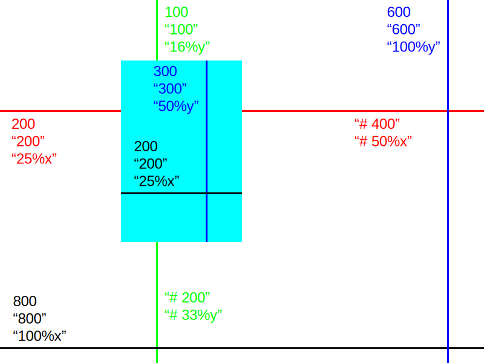

# Documentation of MUI

## Structs

```javascript
struct Window {
pub mut:
        objects      []map[string]WindowData
        focus        string
        color_scheme []gx.Color
        app_data     voidptr
        gg           &gg.Context
}

struct WindowConfig {
pub mut:
        title    string //= ""
        width    int    = 800
        height   int    = 600
        font     string = font.default()
        app_data voidptr
}

union WindowData {
pub mut:
        num int
        str string
        clr gx.Color
        bol bool
        fun OnEvent
        img gg.Image
        tbl [][]string
}


type OnEvent = fn (EventDetails, mut Window, voidptr)

fn empty_fn(event_details EventDetails, mut app Window, app_data voidptr)

struct EventDetails {
        event       string // click, value_change, unclick, keypress
        trigger     string // mouse_left, mouse_right, mouse_middle, keyboard
        value       string
        target_type string
        target_id   string
}


struct Widget {
        hidden         bool   //= false
        path           string //= ""
        text           string //= ""
        placeholder    string //= ""
        table          [][]string = [['']]
        id             string //= ""
        link           string //= ""
        percent        int    //= 0
        value          int    //= 0
        value_max      int = 10
        value_min      int //= 0
        step           int = 1
        checked        bool //= false
        hider_char     string = '*'
        selected       int //= 0
        list           []string     = ['']
        x              int | string = '0'
        y              int | string = '0'
        width          int | string = '125'
        height         int | string = '20'
        onchange       OnEvent      = empty_fn
        onclick        OnEvent      = empty_fn
        onunclick      OnEvent      = empty_fn
        link_underline bool     = true
        background     gx.Color = gx.Color{
                r: 127
                g: 127
                b: 127
        }
}
```

## Functions about Window

```javascript
fn create(args &WindowConfig) &Window
fn run(mut app Window)
```

## Functions about Dialogs

```javascript
fn beep()
fn colorchooser(title string, default_color string) string
fn inputbox(title string, text string, default_text string) string
fn messagebox(title string, text string, dialog_type string, icon_type string) int
fn notifypopup(title string, text string, icon_type string)
fn openfiledialog(title string) string
fn passwordbox(title string, text string) string
fn savefiledialog(title string) string
fn selectfolderdialog(title string) string
```

## Functions that manage widgets

```javascript
fn (mut app Window) button(args Widget)
fn (mut app Window) checkbox(args Widget)
fn (mut app Window) group(args Widget)
fn (mut app Window) image(args Widget)
fn (mut app Window) label(args Widget)
fn (mut app Window) link(args Widget)
fn (mut app Window) password(args Widget)
fn (mut app Window) progress(args Widget)
fn (mut app Window) radio(args Widget)
fn (mut app Window) rect(args Widget)
fn (mut app Window) selectbox(args Widget)
fn (mut app Window) slider(args Widget)
fn (mut app Window) table(args Widget)
fn (mut app Window) textbox(args Widget)

fn (mut app Window) clear_values(id []string)
fn (mut app Window) get_object_by_id(id string) []map[string]WindowData
```

## Anchor System



| Values       | Equal as Pixel                          |
|--------------|-----------------------------------------|
| 80           | `80`px                                  |
| "120"        | `120`px                                 |
| "20%x"       | `Width of window`/`100`*`20` px         |
| "50%y -80"   | (`Height of window`/`100`*`50`)-`80`px  |
| "# 25"       | 25px _from left or bottom_              |

> Values that starts with `#`, can be used in `x` and `y`. Don't use in `width` or `height`.