# Gallery

|Operating System |Screenshots                                     |Operating System |Screenshots                                     |
|-----------------|------------------------------------------------|-----------------|------------------------------------------------|
| Windows 10      |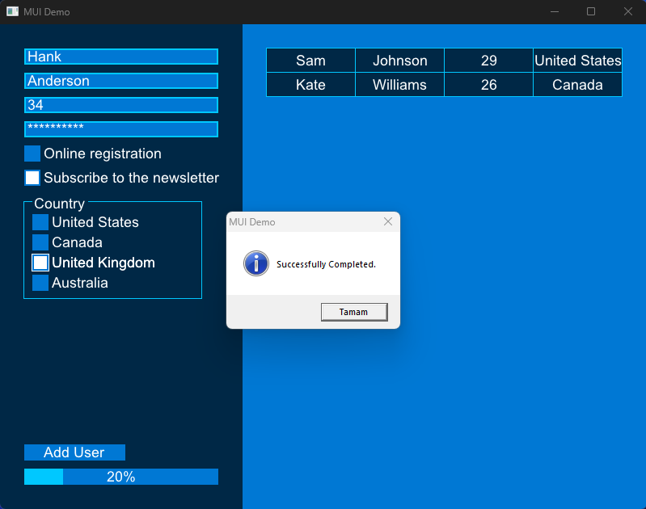 | Windows 7       |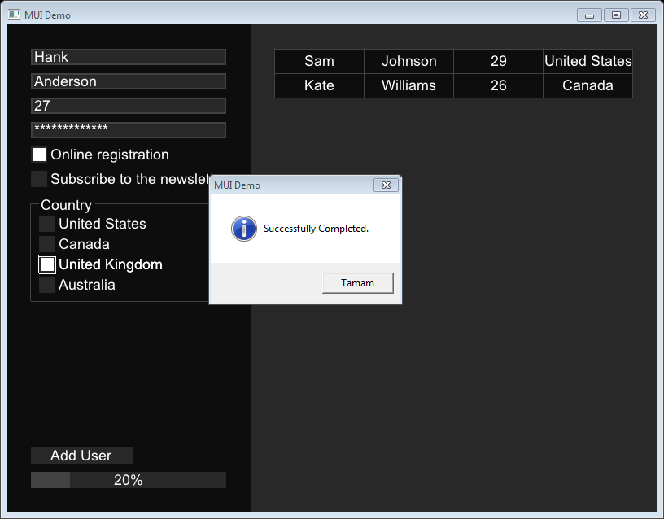|
| Linux (Arch)    |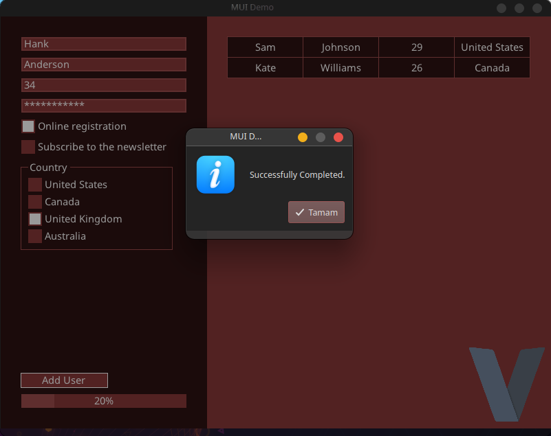          | Linux (Ubuntu)  |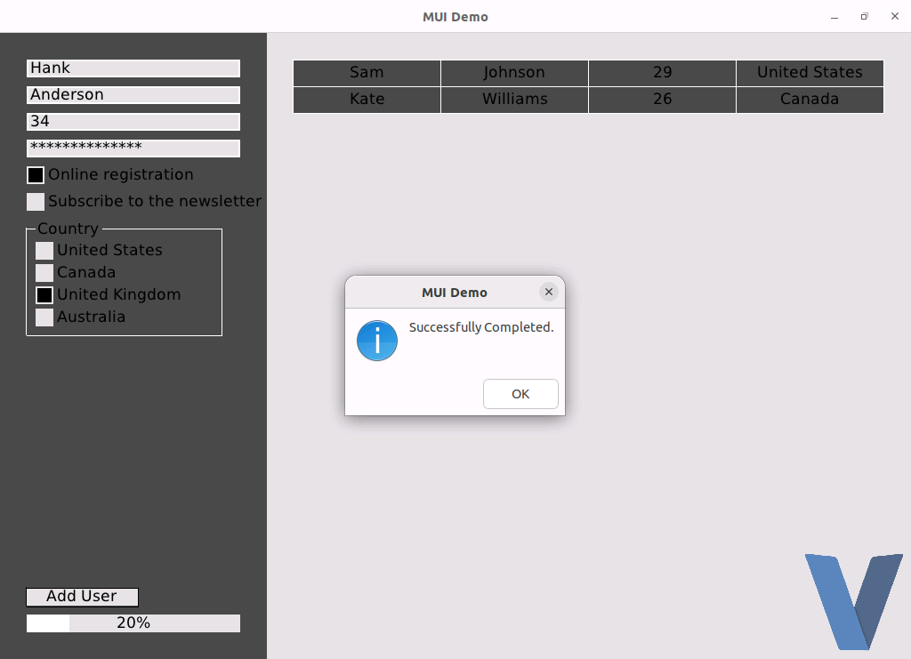       |
| WSL (WSLG)      |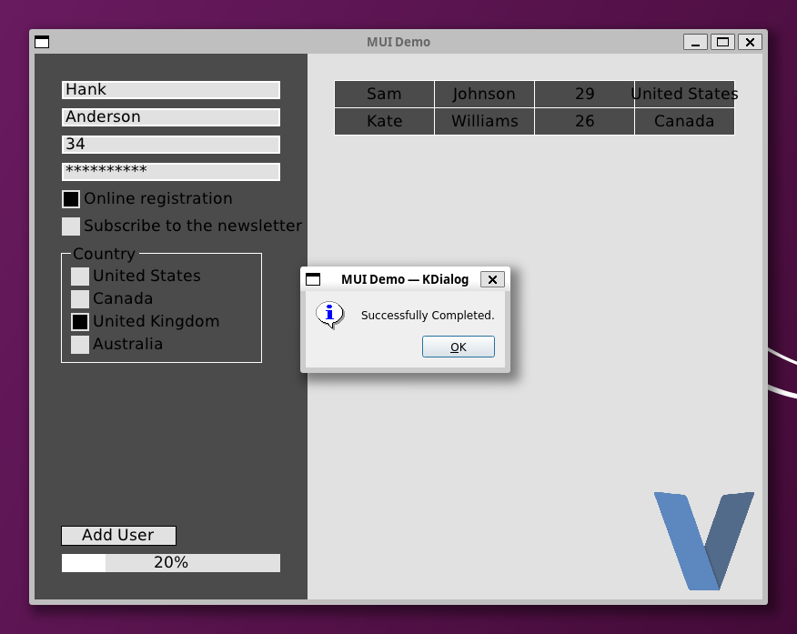             | WSL (VcXsrv)    |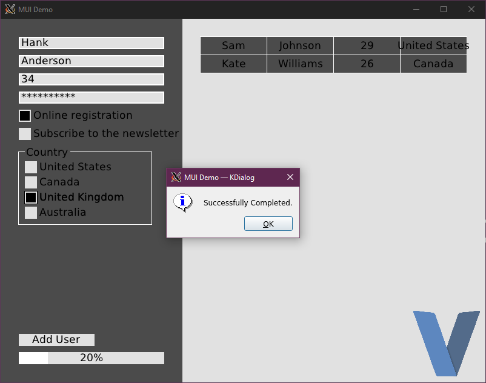       |
| Web (Emscripten)|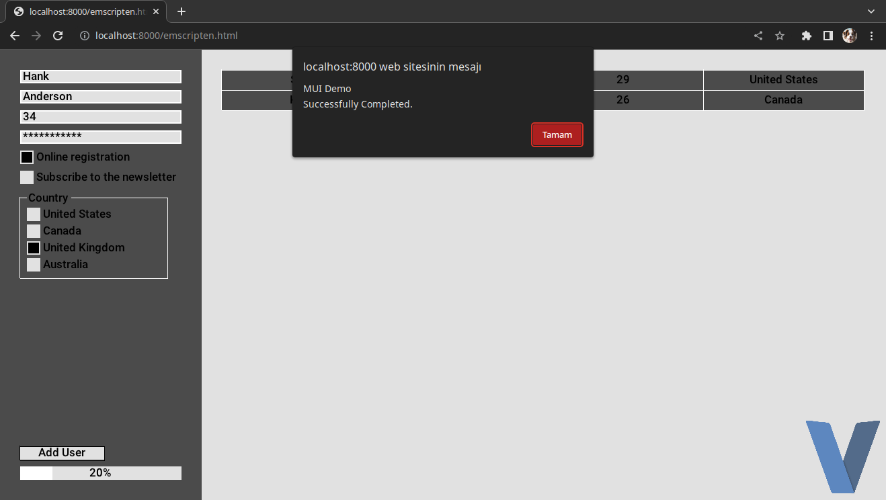                | Wine            |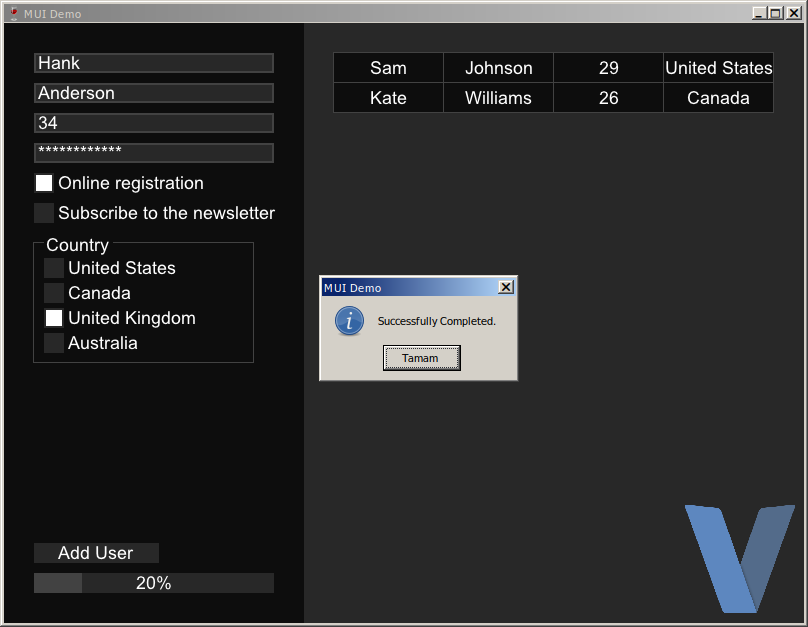             |
| Android         |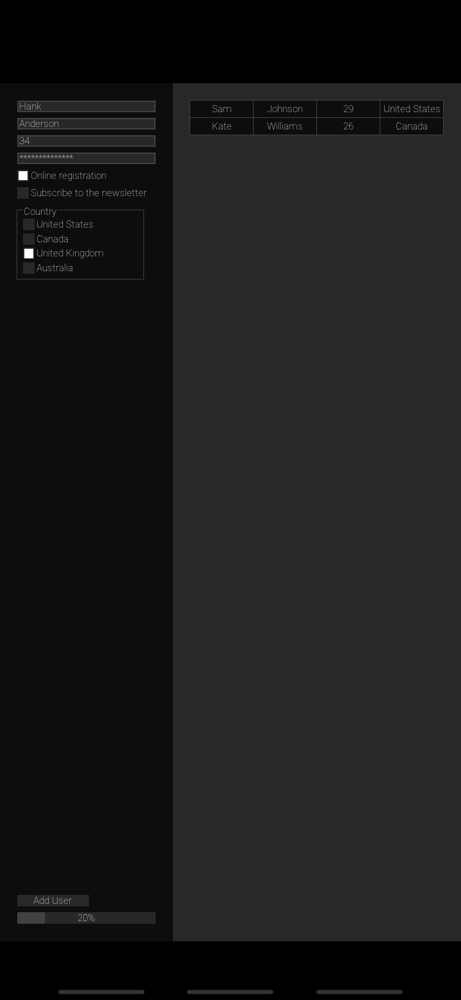    |                 |                                                |

## Real World Examples

### Gezgin Satıcı - [Source Code](https://github.com/malisipi/gezgin-satici)

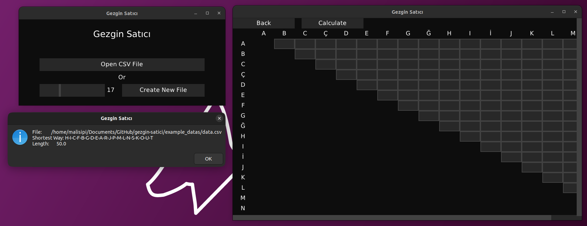

Program tries solve Travelling Salesman Problem in a few seconds.

### VInstall - [Source Code](https://github.com/malisipi/VInstall)

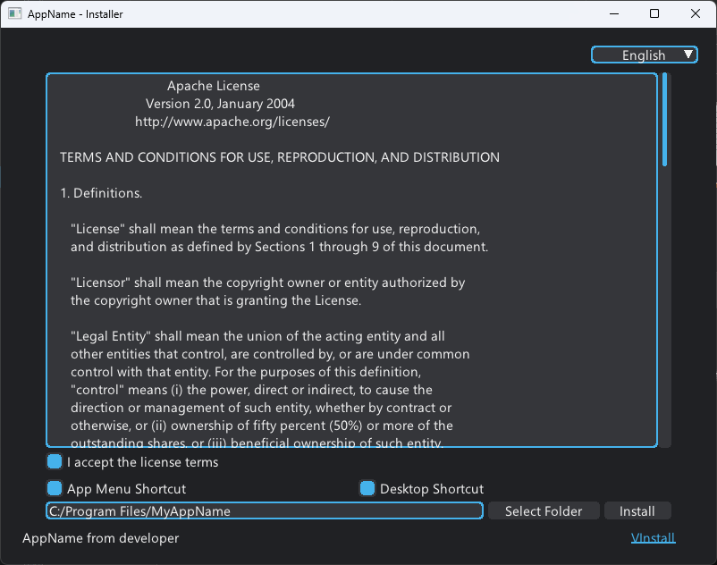

A cross-platform installer creator

### V-Player - [Source Code](https://github.com/malisipi/v-player)

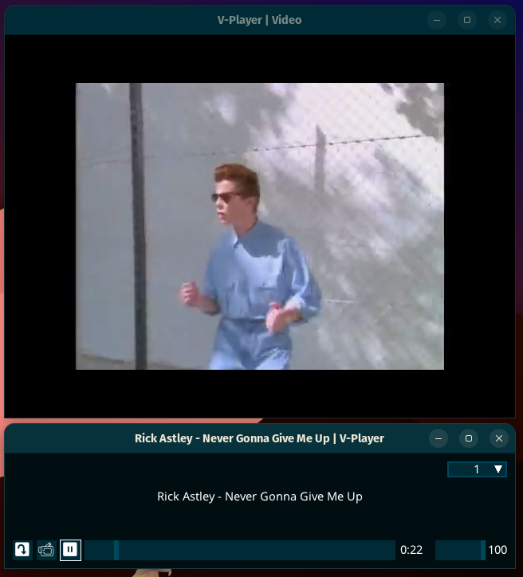

A media player powered with V and MUI

### VRoom - [Source Code](https://github.com/malisipi/vroom)

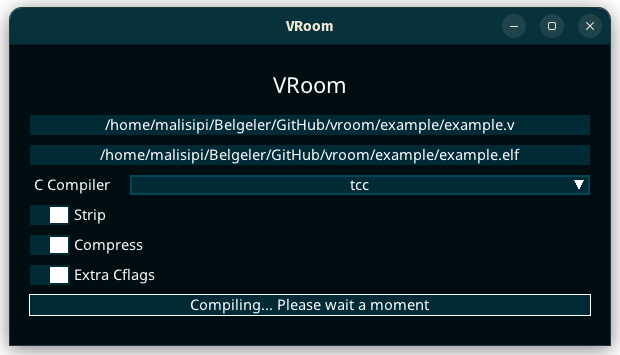

A program to build the smallest Vlang executable possible.

> If you have any application that uses MUI, please let me know.

## Examples Created For Introduction MUI

### Notepad - [Source Code](./examples/notepad.v)

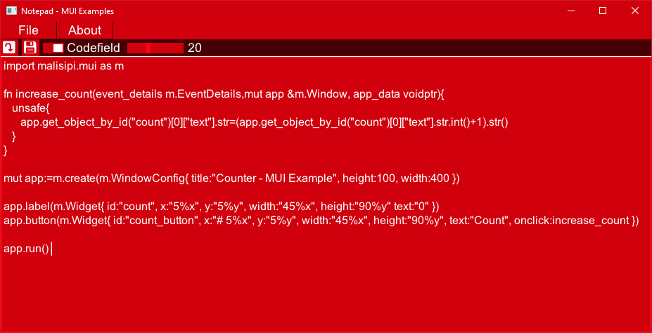

### Player - [Source Code](./examples/player.v)

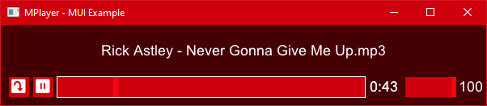

### Line Graph - [Source Code](./examples/line_graph.v)

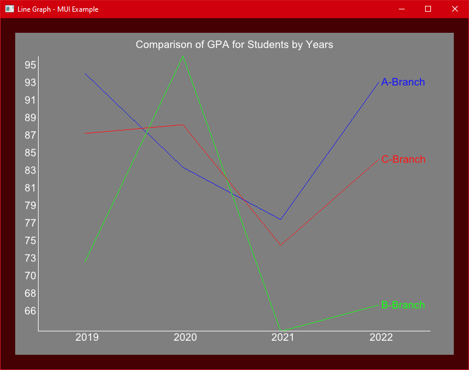

### Cells - [Source Code](./examples/cells.v)

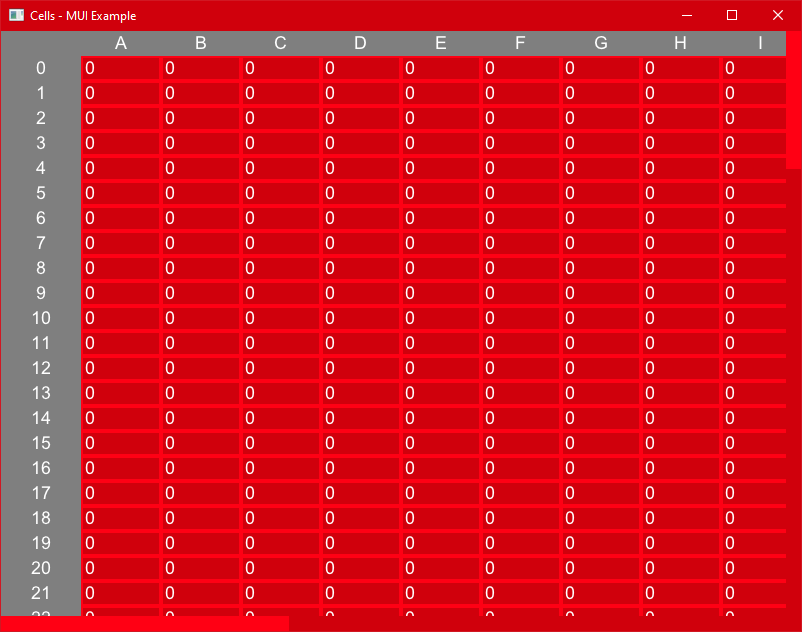

### Articles (Webview Example) - [Source Code](./examples/webview/articles/)

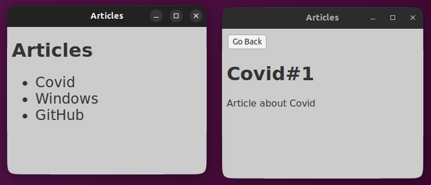
