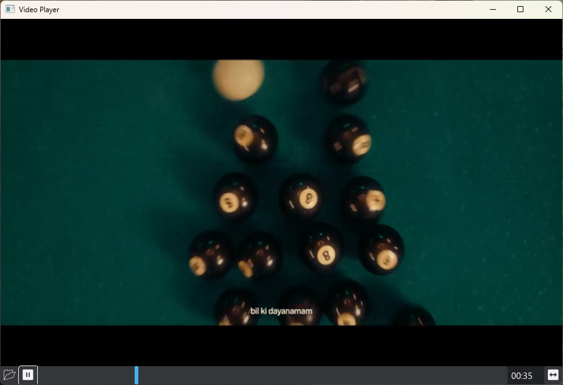

# Thirdparty Widgets/Plugins

> Do you have a widget or plugin for MUI. Let me know to add the list.

## MUIMPV

Run any video inside MUI.
* License: LGPLv3 & GPLv3 (Dual licensed)
* Developer: malisipi
* Github Repo: [A video player plugin](https://github.com/malisipi/muimpv)
* Depencies: libmpv
